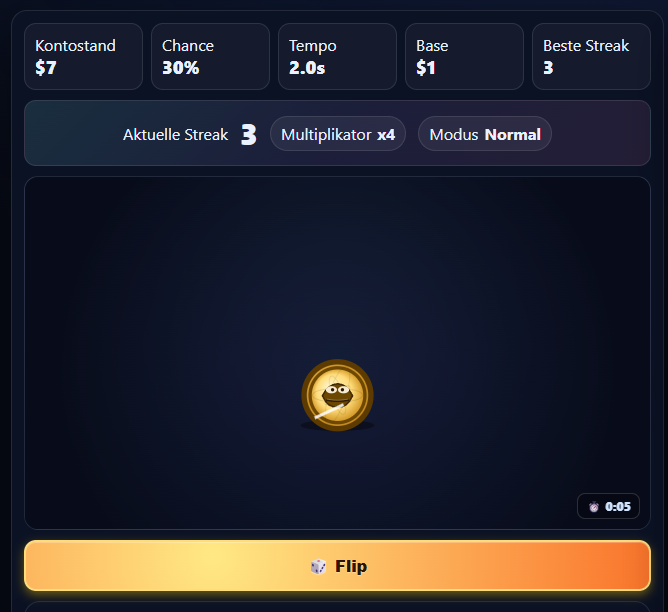

# 🪙 Coin Flip (Browser game)

> **Can you flip heads 10 times in a row?**

A browser-based game with a simple challenge: Flip a coin and get heads **10 in a row** without a single tails. Featuring custom animations, sound effects, and a clean UI.

**[▶ Play Live Demo](https://www.marcel-koebsch.de/coin-flip)**

---

## 🎮 How to Play

1. Click the coin to flip it
2. Get **heads** — keep going
3. Get **tails** — back to zero
4. Reach **10 heads in a row** to win

---

## ✨ Features

- 🎲 **Transparent randomness** — no tricks, pure luck
- 🔢 **Live streak counter** — tracks your current and best run
- 🎬 **Flip animations** — coin rotation on every toss
- 🔊 **Sound effects** — audio feedback for heads, tails, and the win
- 📱 **Fully responsive** — works on desktop and mobile
- ⚡ **Zero dependencies** — plain HTML, CSS & JavaScript

---

## 🛠️ Tech Stack

| Technology | Usage |
|---|---|
| HTML5 | Structure & layout |
| CSS3 | Animations & styling |
| JavaScript (Vanilla) | Game logic & DOM |

---

## 🚀 Getting Started

```bash
# Clone the repository
git clone https://github.com/mkoebsch/coin-flip.git

# Open in your browser
open index.html
```

Or just open `index.html` directly — no server required.

---

## 📸 Preview



---

## 📄 License

This project is open-source under the MIT License. Feel free to use and modify.